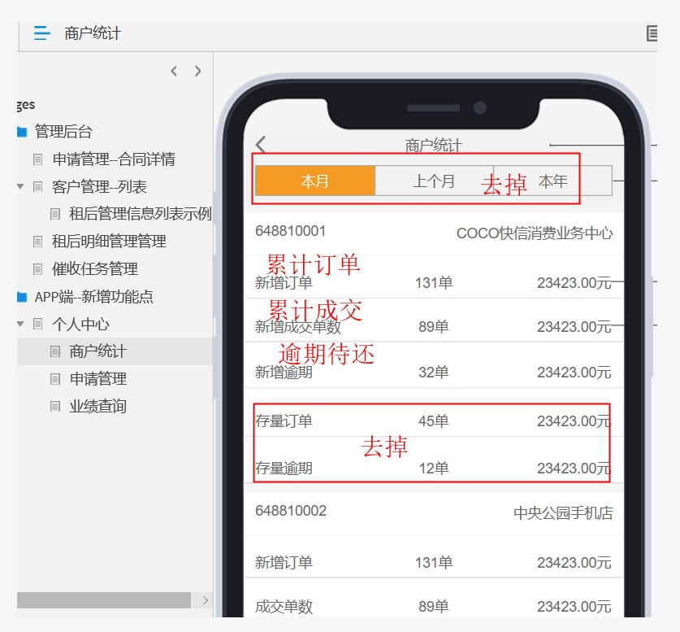

### 说明
    临时开放接口文档 主要便于沟通 和存档
	host 依然使用原来的
### 【客户经理】
### 申请管理-合同概要信息
    原接口地址 http://127.0.0.1:40090/app/contractInfoQueryApp.json?contractId=2020031347675553
### 现接口地址 同；返回内容新增 商铺门店信息字段: store
    "store":{"companyName":"熊超测试门店","storeId":19,"storeCode":"648810001"}
### 查看返回内容 [app.contractInfoQueryApp.json](app.contractInfoQueryApp.json)


### 业绩查询 
    原接口地址 http://127.0.0.1:40090/app/querySalesCommissionYWY.json  入参数：pageSize、pageNumber
### 现接口地址 同；返回内容说明 ；原型中 “成交单数”暂不支持，取消掉。sales_commission
    增加 date 字段：当月日期 如2020-03
    salesCommissionList 数组元素中增加字段 ；字段意义与之前一致。
    {"date":"2020-02","oldLoanAmount":"83.33","newLoanAmount":"17000.00","newLoanCount":17,"newOverdueCount":5,"oldLoanCount":1,"salesCommissionAmount":"0.00","newOverdueAmount":"17000.00","oldOverdueCount":1,"oldOverdueAmount":"0.00"}
    
    新增订单：newLoanAmount  newLoanCount
    成交订单：审核通过	暂不支持，取消
    新增逾期：newOverdueAmount  newOverdueCount
    存量订单：oldLoanAmount  oldLoanCount
    存量逾期	：oldOverdueAmount oldOverdueCount
### 查看返回内容 [app.querySalesCommissionYWY.json](app.querySalesCommissionYWY.json)
    
### 商户统计列表
    以商户分组，统计对应商户，截至当前时间，总合同订单量，总成交合同订单量，总逾期待还合同订单量，总逾期待还本金 
    逾期合同：合同中所有分期还款存在任意个逾期，且，没有还，那么定义未逾期合同；逾期待还金额，该逾期合同，所有未还本金定义为逾期待还本金

### 接口地址 
    http://127.0.0.1:40090/app/queryShopSales.json

### 返回数据
```json
{
    "code": 1,
    "records": [{
            "store_id": 18,
            "store_code": "649110017",
            "all_order_count": 1,
            "all_order_amount": 100000,
            "deal_order_amount": 100000,
            "company_name": "重庆火锅科技有限公司",
            "deal_order_count": 1,
            "overdue_unpay_order_count": 0,
            "unpay_principal_amount": 99996,
            "overdue_unpay_principal_amount": 0,
            "pay_principal_amount": 0
        }, {
            "store_id": 19,
            "store_code": "648810001",
            "all_order_count": 664,
            "all_order_amount": 64597700,
            "deal_order_amount": 56097700,
            "company_name": "熊超测试门店",
            "deal_order_count": 543,
            "overdue_unpay_order_count": 6,
            "unpay_principal_amount": 11702316,
            "overdue_unpay_principal_amount": 455550,
            "pay_principal_amount": 36285822
        }
    ],
    "message": "查询成功"
}

```    

### 返回字段说明
       
    "store_id": 19,  #门店ID
    "store_code": "648810001", #门店编号
    "company_name": "熊超测试门店",#门店公司名称
    "all_order_count": 664,#累计订单总数
    "all_order_amount": 64597700,#累计订单总额
    "deal_order_count": 543,#累计成交订单总数
    "deal_order_amount": 56097700,#累计成交订单总额
    "overdue_unpay_order_count": 6,#逾期待还订单总数
    "overdue_unpay_principal_amount": 455550,#逾期待还订单本金
    "unpay_principal_amount": 11702316, #未还本金 （暂不展示）
    "pay_principal_amount": 36285822 #已还本金（暂不展示）
    
### 注意
    原型有更新调整，请及时查看 “商户统计”
    http://zbox.quhizu.com/zentao/story-view-15.html  
      
      