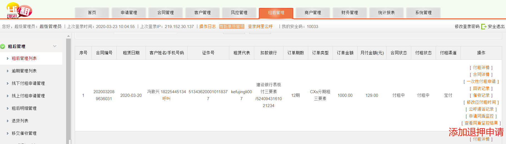
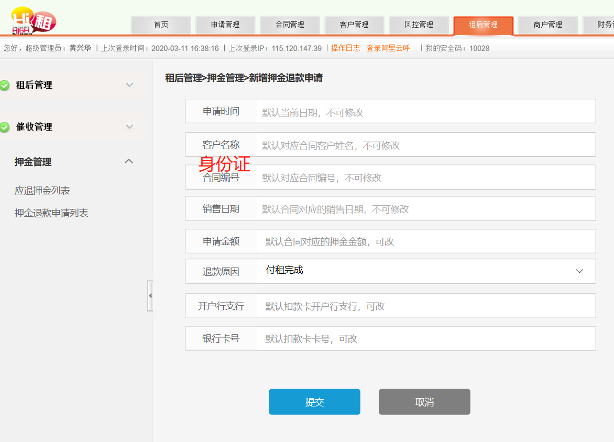

### 说明-退押金开发
     退押金开发说明
     【用户】通过电话向【客服】发起退押申请；
     【客服】通过 手机号/身份证，在“租后管理列表”中查询用户合同（客服有权限查询所有合同），
             人工判断是否能退押（合同已完成，付租完成，付租详情中没有逾期行为）
             点击“添加退押申请”，
             跳转到退押申请页面（携带参数：合同编码），
             通过合同编号自动填充数据字段（其中：金额，卡号，开户行，可改），
             确认提交，保存数据到“退押表”中。
     【财务】查看“退押申请列表”，可以根据时间，合同，状态，用户，筛选，导出，导出后自动设置状态未已退
###  新增“退押表”
      申请时间
      
      客户姓名
      
      身份证
      
      合同编号
      
      销售日期 
      
      申请金额 
      
      退款原因  
      
      开户行支行 
      
      银行卡号
      
      退款状态：新申请-已退款-退款失败

### 时间评估-退押金开发 
    全职两个工作日，兼职一周，预定交付时间3.28上午。
    任务指派，M先生
    
### 图片
        
        
       
    	
	   